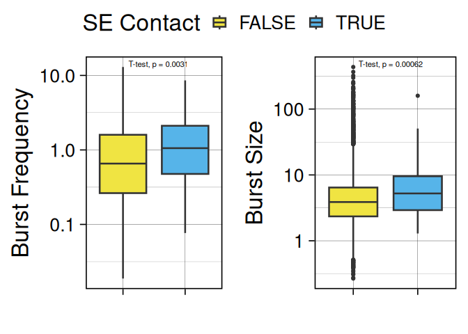
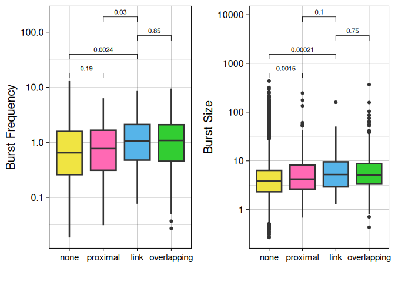
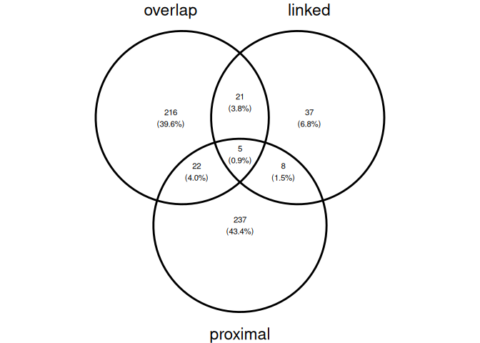

Connecting Super-Enhancers, Promoters and Transcriptional Kinetics
================
Benjamin Clark, Msc

### Preamble

#### What is the relationship between super-enhancers, chromatin folding and transcriptional kinetics? Here we take MEF transcriptional kinetics data and compare the frequency and size of transcriptional events (bursts) of genes that are physically connected (or in close proximity in 3D space) to a super enhancer.

Setting up and pulling in data for H3K27ac chromatin loops.

``` r
library(dplyr)

#making a named vector where the names are the left anchor and values are right
left_anchor <- read.delim("hichip_data/left_anchor.bed", header = F)[,1]
right_anchor <- read.delim("hichip_data/right_anchor.bed", header = F)[,1]
#removing self linkages
anchors <- cbind(left_anchor, right_anchor)
anchors <- anchors[-which(anchors[,1] == anchors[,2]),]
```

Running intersections of anchors with super-enhancers

``` r
command1 <- "bedtools intersect -v -a rose_out/se_loci.bed -b hichip_data/promoters_300.bed > filtered_loci_se.bed"
command2 <- "bedtools intersect -b  filtered_loci_se.bed -a hichip_data/right_anchor_formatted.bed -wa -wb | uniq > right_se.bed"
command3 <- "bedtools intersect -b  filtered_loci_se.bed -a hichip_data/left_anchor_formatted.bed -wa -wb | uniq > left_se.bed"

system(command1)
system(command2)
system(command3)
```

Some data wrangling. Essentially we have to take two linkage maps (right
to left, left to right) that are undirected and figure which contacts
are promoter-SE. The general idea is to transform BED coordinates into a
single string key that matches the hichip coords.

``` r
toKey <- function(row, indices){
  return(paste0(row[1], ":", row[2], "-", row[3]))
}

bed_convert <- function(item){
  gsub("[:-]", "\t", item)
}


left_se <- read.delim("left_se.bed", sep = "\t", header = F)
right_se <- read.delim("right_se.bed", sep = "\t", header = F)
left_promoters <- read.delim("hichip_data/left_promoters.bed", sep = "\t", header = F)
right_promoters <- read.delim("hichip_data/right_promoters.bed", sep = "\t", header = F)

#first three columns in promoters are the intersecting point
left_promoters_keyed <- left_promoters%>% rowwise() %>% mutate(left_anchor  = toKey(c(V1,V2,V3)))
right_promoters_keyed <- right_promoters%>% rowwise() %>% mutate(right_anchor  = toKey(c(V1,V2,V3)))
#in SE file the last three columns are the intersecting point
left_se_keyed <- left_se %>% rowwise() %>% mutate(left_anchor  = toKey(c(V1,V2,V3)))
right_se_keyed <- right_se %>% rowwise() %>% mutate(right_anchor  = toKey(c(V1,V2,V3)))
#using the anchor df:
#query promoter links off the opposite column then filter results off of SE point in the opposite orientation:
 #e.g get right anchors for left promoters, keep only the right anchors which are found in the right_se file.
promoter_lr_se <- left_promoters_keyed %>% left_join(as.data.frame(anchors), by=join_by(left_anchor)) %>% inner_join(right_se_keyed, by=join_by("right_anchor"))

promoter_rl_se <- right_promoters_keyed %>% left_join(as.data.frame(anchors), by=join_by("right_anchor")) %>% inner_join(left_se_keyed, by=join_by("left_anchor"))

#now row bind
promoter_se <- rbind(promoter_lr_se, promoter_rl_se)
```

Now we need to make sure we haven’t inflated the number of linkages by
using multiple promoter annotations. Here we’re going to take the most
connected promoter annotation.

``` r
clipname <- function(fullname){
  return(substr(fullname, 1, nchar(fullname) - 2))
}

#left_to_right_promoters <- read.delim("left_se_to_right_prom.bed", header = F)
#right_to_left_promoters <- read.delim("right_se_to_left_prom.bed", header = F)
#all_linked_promoters <- rbind(left_to_right_promoters, right_to_left_promoters)
promoter_se["gene"] <- sapply(promoter_se$V7.x, FUN = clipname)


#getting unique promoter annotations
genes <- promoter_se$gene
unique_linked_promoters <- promoter_se
for(gene_name in unique(genes)){
  #gene_group <- all_linked_promoters %>% filter(gene == gene_name)
  gene_group <- promoter_se %>% filter(gene == gene_name)
  if(length(unique(gene_group$V7.x)) > 1){
    not_gene_anno <- names(which.min(table(gene_group$V7.x)))
    unique_linked_promoters <- unique_linked_promoters %>% filter(V7.x != not_gene_anno)
  }
}

unique_linked_promoters_filtered <- unique_linked_promoters %>% dplyr::distinct(left_anchor, right_anchor, .keep_all = T)

#unique_linked_promoters_promkey_linked <- unique_linked_promoters_promkey %>% left_join(as.data.frame(anchors), join_by("promkey" == "left_anchor")) %>% mutate(linked_SE = case_when(promkey != right_anchor ~ right_anchor, .default = NA)) %>% select(-c(right_anchor)) %>% left_join(as.data.frame(anchors), join_by("promkey" == "right_anchor"))

linked_genes <- unique_linked_promoters_filtered$gene
genereps <- table(linked_genes)
unique_genes <- names(genereps)
write(unique_genes, "linked_genes_common_names.txt")
```

Getting kinetics data and annotations. I use the MGI database to take
common names and turn them into Ensembl IDs.

``` r
kinetics <- readxl::read_excel("hichip_data/journal.pcbi.1008772.s006.xlsx", sheet = "C57")
```

    ## New names:
    ## • `` -> `...2`
    ## • `` -> `...3`
    ## • `` -> `...4`
    ## • `` -> `...5`
    ## • `` -> `...6`
    ## • `` -> `...7`
    ## • `` -> `...8`
    ## • `` -> `...9`
    ## • `` -> `...10`

``` r
colnames(kinetics) <- kinetics[1,]
kinetics <- kinetics[-1,]

#loading ens annotations
ens <- read.delim("MGIBatchReport_20240501_114114.txt")
ens_unique <- ens %>% distinct(Input, .keep_all = T)
ens_unique$SE_linked <- T


kinetics_se <- kinetics %>% left_join(ens_unique, by = join_by("gene_id" == "Ensembl.ID"))
kinetics_se$k_on <- as.numeric(kinetics_se$k_on)
kinetics_se$bs <- as.numeric(kinetics_se$k_syn)/as.numeric(kinetics_se$k_off)
kinetics_se$SE_linked <- !is.na(kinetics_se$SE_linked)
```

Drawing figures. Does a linkage to an SE mean faster and bigger bursts
of mRNA?

``` r
library(ggplot2)
library(ggpubr)


bf_fig <- ggplot(kinetics_se, aes(x=factor(SE_linked), k_on, fill = SE_linked)) +
        #geom_violin() +
        geom_boxplot(show.legend = F, linewidth = 0.9, fatten = T) +
        theme_linedraw(base_size = 25) +
        theme(axis.text.x=element_text(size=rel(0.95))) +
        ylab( "Burst Frequency") +
        scale_y_log10() +
        xlab("") +
        scale_x_discrete(labels = NULL) +
        scale_fill_discrete(name = "SE Contact", type = c("#F0E442", "#56B4E9")) +
        #scale_fill_manual(values = c("#E69F00", "#56B4E9")) +
        stat_compare_means(method = "t.test", label.x.npc = 0.28, size = 3)

bs_fig <- ggplot(kinetics_se, aes(x=factor(SE_linked), bs, fill = SE_linked)) +
        #geom_violin() +
        geom_boxplot(linewidth = 0.9, fatten = T) +
        theme_linedraw(base_size = 25) +
        theme(axis.text.x=element_text(size=rel(0.95))) +
        ylab( "Burst Size") +
        scale_y_log10() +
        xlab("") +
        scale_x_discrete(labels = NULL) +
        scale_fill_discrete(name = "SE Contact", type = c("#F0E442", "#56B4E9")) +
        #scale_fill_manual(values = c("#E69F00", "#56B4E9")) +
        stat_compare_means(method = "t.test", label.x.npc = 0.28, size = 3)

ggarrange(bf_fig, bs_fig, common.legend = T)
```

<!-- -->

``` r
# #bf <- ggplot(kinetics_se, aes(x=SE_linked, y=k_on)  ) + geom_boxplot() +
#         theme_linedraw(base_size = 30) +
#         theme(axis.text.x=element_text(size=rel(0.95))) +
#         ylab( "Burst Frequency") +
#         scale_y_log10() +
#         xlab("") +
#         scale_fill_discrete(name = "Enhancer-Promoter Contact", type = c("#F0E442", "#56B4E9"))+
#         #scale_fill_manual(values = c("#E69F00", "#56B4E9"))
#         stat_compare_means(method = "t.test", label.x.npc = 0.28, size = 9)
#
# bf
# ggplot(kinetics_se) + geom_boxplot(aes(x=SE_linked, y=bs)) + scale_y_log10()
```

Making a bigInteract file to view linkages on UCSC.

``` r
make.bigInteract <- function(df){
  require(dplyr)
  df.1 <- df %>% dplyr::select("V1.x", "V2.x", "V10.y") %>%
          dplyr::mutate("name" = c("."), "score" = c(300), "value" = 3, "exp" = ".", "color" = 0)

  df.1[which(df.1$V2.x > df.1$V10.y), c("V2.x", "V10.y")] <- rev(df.1[which(df.1$V2.x > df.1$V10.y), c("V2.x", "V10.y")])
  #df.1 <- df %>% dplyr::select("V1.x", "V2.x", "V10.y") %>%
  #        dplyr::mutate("name" = c("."), "score" = c(300), "value" = 3, "exp" = ".", "color" = 0) %>%
  #        transform(V2.x = ifelse(V2.x > V10.y, V10.y, V2.x)) %>%
  #       transform(V10.y = ifelse(V10.y < V2.x, V2.x, V10.y))
          #rowwise() %>%
          #mutate(V10.y = case_when(as.integer(V2.x) > as.integer(V10.y) ~ V2.x, .default = V10.y), V2.x = case_when(as.integer(V2.x) > as.integer(V10.y) ~ V10.y, .default = V2.x))

  df.2 <- df %>% dplyr::select("V1.x", "V2.x", "V3.x") %>% dplyr::mutate("sourcename" = c("."), "sourcestrand" = ".") %>% dplyr::rename("sourceChrom" = "V1.x", "sourceStart" = "V2.x", "sourceEnd" = "V3.x")

  df.3 <- df %>% dplyr::select("V8.y", "V9.y", "V10.y") %>% dplyr::mutate("targetname" = c("."), "targetstrand" = ".") %>% dplyr::rename("targetChrom" = "V8.y", "targetStart" = "V9.y", "targetEnd" = "V10.y")

  return(cbind(df.1,df.2,df.3))
}
#View(make.bigInteract(unique_linked_promoters_filtered))
readr::write_delim(make.bigInteract(unique_linked_promoters_filtered), delim = "\t", col_names = F, file = "se_hichip.interact")
```

Getting proximal genes to super enhancers.

``` r
proximity <- read.delim("rose_out/rose_enhancers_SuperStitched_REGION_TO_GENE.txt", sep = "\t", header = T)

write(unlist(sapply(proximity$OVERLAP_GENES, strsplit, ",", USE.NAMES = F)), file = "overlapping_genes.txt")
write(unlist(sapply(proximity$CLOSEST_GENE, strsplit, ",", USE.NAMES = F)), file = "closest_genes.txt")
write(unlist(sapply(proximity$PROXIMAL_GENES, strsplit, ",", USE.NAMES = F)), file = "proximal_genes.txt")
overlap.anno <- read.delim("overlap_genes_anno.txt")
closest.anno <- read.delim("closest_genes_anno.txt")
proximal.anno <- read.delim("proximal_annotxt")

kinetics_se <- kinetics_se %>% rowwise() %>% mutate(overlap = any((case_when(overlap.anno$Ensembl.ID %in% gene_id ~ TRUE, .default =F )))) %>% mutate(closest = any((case_when(closest.anno$Ensembl.ID %in% gene_id ~ TRUE, .default =F )))) %>% mutate(proximal = any((case_when(proximal.anno$Ensembl.ID %in% gene_id ~ TRUE, .default =F ))))
```

Making a new dataframe thats annotated for linkages and proximity to a
super-enhancer.

``` r
library(car)
df_factor <- kinetics_se %>% mutate(relation = case_when(SE_linked ~ "link",
                                                          overlap & !(SE_linked) ~ "overlapping" ,
                                                          #closest & !(overlap) ~ "closest",
                                                          #closest & !(SE_linked) & !overlap ~ "closest",
                                                          proximal & !(SE_linked) & !overlap~ "proximal",
                                                          .default = "none"))
```

Drawing figures. Does it matter if there’s a chromatin loop to an SE?
What happens if the gene is overlapping or super close to an SE in terms
of genomic distance(\> 50kb)

``` r
bf_fig <- ggplot(df_factor, aes(x=reorder(factor(relation), k_on, FUN = median), k_on, fill = factor(relation) )) +
        #geom_dotplot(binaxis = "y", binwidth = 0.015, color = "blue", alpha = 0.4, dotsize = 1.7) +
        geom_boxplot(show.legend = F, linewidth = 0.9, fatten = T) +
        theme_linedraw(base_size = 15) +
        theme(axis.text.x=element_text(size=rel(0.95))) +
        ylab( "Burst Frequency") +
        scale_y_log10() +
        xlab("") +
        #scale_x_discrete() +
        scale_fill_manual(values = c("none" = "#F0E442", "proximal" = "#FF69B4", "link" = "#56B4E9", "overlapping" = "#32CD32")) +
        #scale_fill_manual(values = RColorBrewer::brewer.pal(4, "Set2")) +
        stat_compare_means(comparisons = list(c("none","proximal"), c("none", "link"), c("overlapping", "link"), c("proximal", "link")), size = 3)

bs_fig <- ggplot(df_factor, aes(x=reorder(factor(relation), k_on, FUN = median), bs, fill = factor(relation))) +
        #geom_violin() +
        geom_boxplot(linewidth = 0.9, fatten = T, show.legend = F) +
        theme_linedraw(base_size = 15) +
        theme(axis.text.x=element_text(size=rel(0.95))) +
        ylab( "Burst Size") +
        scale_y_log10() +
        xlab("") +
        scale_fill_manual(values = c("none" = "#F0E442", "proximal" = "#FF69B4", "link" = "#56B4E9", "overlapping" = "#32CD32")) +
        #scale_fill_discrete(name = "SE Contact", type = c("#F0E442", "#56B4E9")) +
        #scale_fill_manual(values = RColorBrewer::brewer.pal(4, "Set2")) +
        stat_compare_means(comparisons = list(c("none","proximal"), c("none", "link"), c("overlapping", "link"), c("proximal", "link")), size = 3)

ggarrange(bf_fig, bs_fig, common.legend = F)
```

<!-- -->

Some interesting observations: an overlapping SE is just as good as a
linked one. Genomic proximity only makes burst sizes bigger while burst
frequency stays the same.

Making a Venn diagram of the different groups from above.

``` r
library(ggVennDiagram)
overlap <- df_factor$gene_id[which(df_factor$overlap)]
link <- df_factor$gene_id[which(df_factor$SE_linked)]
closest <- df_factor$gene_id[which(df_factor$closest)]
proximal <- df_factor$gene_id[which(df_factor$proximal)]

x <- list("overlap" = overlap, "linked" = link, "proximal" = proximal)

ggvenn::ggvenn(x, fill_color = rep("white", 4), stroke_size = 1, text_size = 3)
```

<!-- -->
